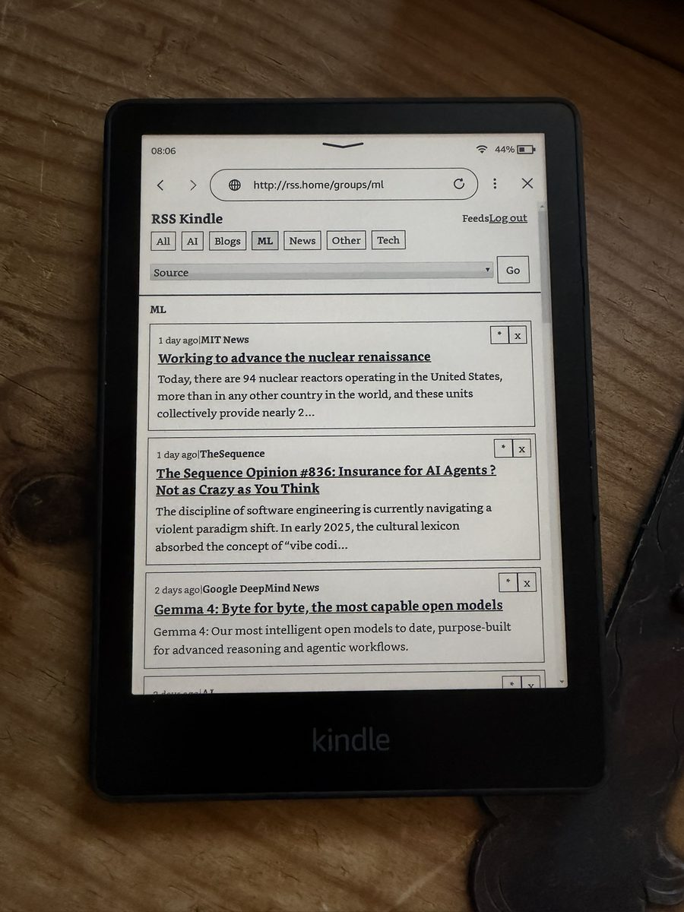
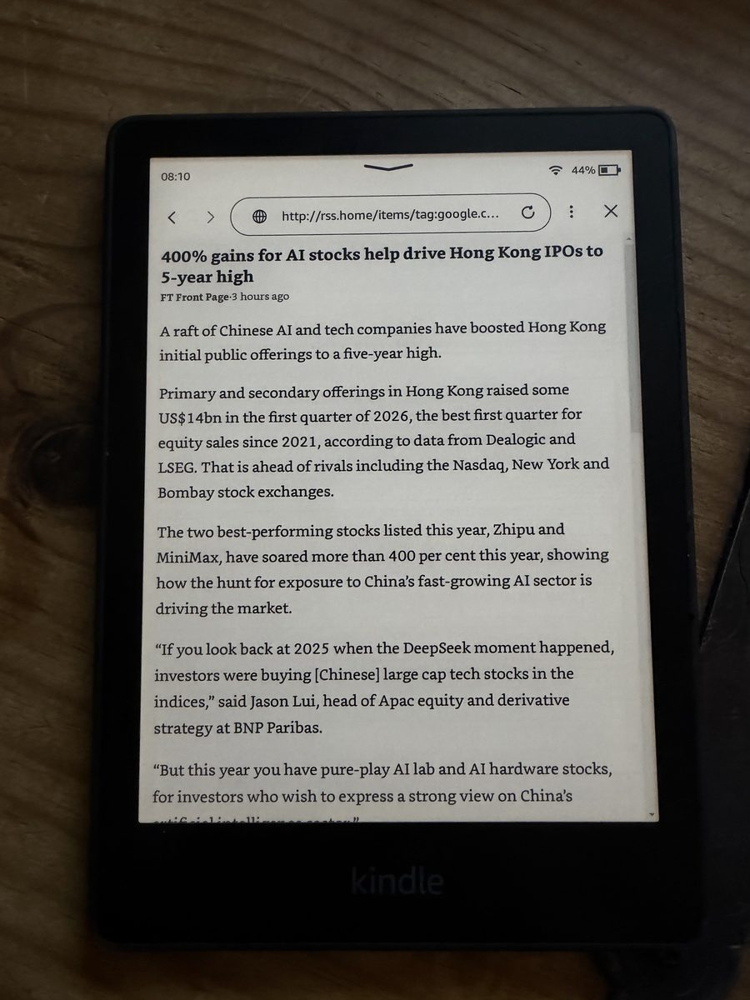
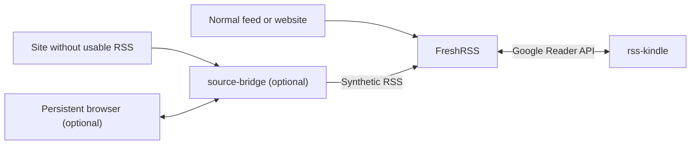

# RSS Kindle

`rss-kindle` is a self-hosted, Kindle-friendly reading interface for FreshRSS.

It is built for the common setup where FreshRSS already handles subscriptions, polling, unread state, and stars, and you want a much lighter reading UI for an e-ink browser.

## Screenshots

Actual Kindle views of the unread queue and an extracted article page:

<p align="center">
  
  
</p>

## Overview

Use this project when you want:

- a lightweight reading UI for a single FreshRSS account on Kindle or other low-power browsers
- automatic mark-as-read behavior when you open an item
- a local cache of extracted article bodies for faster re-reads
- optional bridge-assisted extraction for sites with weak or missing RSS feeds

If you already run FreshRSS and only want a better reading surface, you can ignore `source-bridge` and `browser-cdp`.

## Components

- `rss-kindle`: the reader UI and the main product in this repository
- FreshRSS: required; it remains the source of truth for subscriptions, unread state, and stars
- `source-bridge`: optional; generates synthetic RSS feeds and extraction fallbacks for difficult sites
- `browser-cdp`: optional; provides a long-lived Chromium session for automation-sensitive sites
- [`examples/reader-with-freshrss`](examples/reader-with-freshrss): bundled `rss-kindle` + FreshRSS example
- [`examples/full-stack`](examples/full-stack): bundled `rss-kindle` + FreshRSS + `source-bridge` + Caddy example

## Requirements

You need:

- Python 3.11+ and [`uv`](https://docs.astral.sh/uv/) for local development, or Docker for container-based setup
- a FreshRSS instance with API access enabled for the account `rss-kindle` will use
- a FreshRSS username and API password for that account

For FreshRSS itself, the default and recommended starting point is FreshRSS's own form login. `rss-kindle` is a separate frontend that reads from FreshRSS over the Google Reader API.

## Recommended Deployment Order

Most users should do this in order:

1. Get FreshRSS working first.
2. Run `rss-kindle` by itself against that FreshRSS instance.
3. If you also want to self-host FreshRSS, use the bundled reader + FreshRSS example.
4. Add `source-bridge` only if a site has no usable RSS feed or needs authenticated/browser-backed extraction.
5. Add `browser-cdp` only if a bridged site behaves badly under ordinary short-lived Playwright sessions.

## Quick Start

Choose one path:

1. You already have FreshRSS and just want the reader UI.
2. You want to self-host `rss-kindle` and FreshRSS together.
3. You want the full stack, including `source-bridge`.

### Path A: You Already Have FreshRSS

For the FreshRSS account `rss-kindle` should use:

1. Enable `Allow API access`.
2. Set an `API password`.
3. Note the username.
4. Note the API URL.

`FRESHRSS_API_URL` can be either:

- the full Google Reader endpoint, for example `https://freshrss.example.com/api/greader.php`
- or a FreshRSS base URL, for example `https://freshrss.example.com`

FreshRSS docs:

- [Mobile access](https://freshrss.github.io/FreshRSS/en/users/06_Mobile_access.html)
- [Google Reader API](https://freshrss.github.io/FreshRSS/en/developers/06_GoogleReader_API.html)

Before moving on, verify that your existing FreshRSS UI loads in a browser, for example:

- `https://freshrss.example.com/`

Then run the reader:

```bash
cp .env.example .env
```

Edit `.env` and set:

- `FRESHRSS_API_URL`
- `FRESHRSS_USERNAME`
- `FRESHRSS_API_PASSWORD`

Optional for a protected reader:

- `APP_AUTH_USERNAME`
- `APP_AUTH_PASSWORD`
- `APP_AUTH_SECRET`
- `APP_SECURE_COOKIES=false` for local plain-HTTP testing only

```bash
docker compose up --build -d rss-kindle
```

Verify:

- Kindle UI: [http://127.0.0.1:8000/](http://127.0.0.1:8000/)
- FreshRSS UI: your existing FreshRSS URL

If this is enough for your workflow, stop here.

### Path B: You Want To Self-Host FreshRSS Too

Use the bundled example in [examples/reader-with-freshrss](examples/reader-with-freshrss).

That stack includes:

- `rss-kindle`
- FreshRSS

Start FreshRSS first:

```bash
docker compose -f examples/reader-with-freshrss/docker-compose.yml up -d freshrss
```

Verify FreshRSS:

- FreshRSS setup or login UI: [http://127.0.0.1:8081/](http://127.0.0.1:8081/)

Then:

1. Complete the normal FreshRSS setup flow.
2. Create the FreshRSS account that `rss-kindle` should use.
3. Enable API access and set an API password for that account.

FreshRSS itself will continue to use FreshRSS's own login page. That is separate from the optional built-in `rss-kindle` login described later in this README.

Start the reader:

```bash
FRESHRSS_USERNAME=your-freshrss-username \
FRESHRSS_API_PASSWORD=replace-me \
docker compose -f examples/reader-with-freshrss/docker-compose.yml up -d rss-kindle
```

Optional for a protected reader in this path:

- `APP_AUTH_USERNAME`
- `APP_AUTH_PASSWORD`
- `APP_AUTH_SECRET`
- `APP_SECURE_COOKIES=false` while testing on plain `http://127.0.0.1:8000`

Those variables can be exported in the shell before the `docker compose` command or placed in a Compose `.env` file.

Verify:

- FreshRSS UI: [http://127.0.0.1:8081/](http://127.0.0.1:8081/)
- Kindle UI: [http://127.0.0.1:8000/](http://127.0.0.1:8000/)

If this covers your use case, stop here. If you later need bridged sites, move on to Path C.

### Path C: You Want The Full Stack

Use [examples/full-stack](examples/full-stack) when you want:

- `rss-kindle`
- FreshRSS
- `source-bridge`
- Caddy

This is the bridge-inclusive deployment path for sites that need synthetic RSS or authenticated extraction.

Prepare the bridge config:

```bash
cp source-bridge.example.toml source-bridge.toml
export RSS_KINDLE_SOURCE_BRIDGE_CONFIG="$(pwd)/source-bridge.toml"
```

Start FreshRSS first:

```bash
docker compose -f examples/full-stack/docker-compose.yml up -d freshrss
```

Verify FreshRSS:

- FreshRSS setup or login UI: [http://127.0.0.1:8081/](http://127.0.0.1:8081/)

Then:

1. Complete the normal FreshRSS setup flow.
2. Create the FreshRSS account that `rss-kindle` should use.
3. Enable API access and set an API password for that account.

FreshRSS itself will continue to use FreshRSS's own login page. That is separate from the optional built-in `rss-kindle` login described later in this README.

Start the rest of the stack:

```bash
FRESHRSS_API_URL=http://freshrss/api/greader.php \
FRESHRSS_USERNAME=your-freshrss-username \
FRESHRSS_API_PASSWORD=replace-me \
docker compose -f examples/full-stack/docker-compose.yml up -d rss-kindle source-bridge caddy
```

Optional but recommended in this path:

- `APP_AUTH_USERNAME`
- `APP_AUTH_PASSWORD`
- `APP_AUTH_SECRET`
- `APP_ALLOWED_HOSTS`
- `SOURCE_BRIDGE_ACCESS_TOKEN`
- `APP_SECURE_COOKIES=false` only if you are testing over plain HTTP instead of HTTPS

Those variables can be exported in the shell before the `docker compose` command or placed in a Compose `.env` file.

Verify:

- FreshRSS UI: [http://127.0.0.1:8081/](http://127.0.0.1:8081/)
- Kindle UI through Caddy: [http://127.0.0.1/](http://127.0.0.1/)

By default, `source-bridge` stays internal to the Docker network in this example. FreshRSS should subscribe to it using:

```text
http://source-bridge:8100/synthetic/<source_id>.xml
```

If you want a host-visible bridge endpoint on port `8100`, use the root [`docker-compose.yml`](docker-compose.yml) instead of the full stack example.

## How It Fits Together

- FreshRSS polls feeds and stores subscription state.
- `rss-kindle` reads from FreshRSS over the Google Reader API and renders a Kindle-friendly UI.
- `source-bridge`, when enabled, publishes synthetic RSS feeds that FreshRSS can subscribe to.
- `rss-kindle` can also use `source-bridge` as an authenticated extraction helper for difficult sites.



## What `rss-kindle` Does

- shows unread items from one FreshRSS account
- uses FreshRSS feeds and groups directly for navigation
- marks items read when you open them
- supports starring and unstarring
- prefers extracted full article text when possible
- falls back to feed-provided content when extraction fails
- caches extracted article HTML locally in SQLite

## Optional: Add `source-bridge`

Add `source-bridge` only when you need it.

Typical reasons:

- a site has no RSS feed
- a site's feed is incomplete or poor quality
- a site requires login or a browser-backed session before articles are readable

To start it:

```bash
cp source-bridge.example.toml source-bridge.toml
docker compose up --build -d rss-kindle source-bridge
```

FreshRSS can then subscribe to synthetic feeds at:

```text
http://<host>:8100/synthetic/<source_id>.xml
```

For the included FT example:

```text
http://<host>:8100/synthetic/ft-home.xml
```

All detailed bridge documentation is in [docs/source-bridge.md](docs/source-bridge.md).

## Optional: Add `browser-cdp`

The `browser-cdp` sidecar is only for sites that behave differently when Playwright launches a short-lived browser itself.

Start it with:

```bash
docker compose --profile browser-cdp up --build -d browser-cdp
```

Then point the relevant bridge auth profile at:

```toml
browser_cdp_url = "http://browser-cdp:9223"
```

## Bundled Reference Stack

There are two bundled examples:

- [`examples/reader-with-freshrss`](examples/reader-with-freshrss): `rss-kindle` + FreshRSS
- [`examples/full-stack`](examples/full-stack): `rss-kindle` + FreshRSS + `source-bridge` + Caddy

Use the smaller one unless you already know you need bridged sites.

## Configuration

### Core `rss-kindle` Environment Variables

| Variable | Required | Purpose | Default |
| --- | --- | --- | --- |
| `FRESHRSS_API_URL` | yes | FreshRSS base URL or Google Reader API URL | none |
| `FRESHRSS_USERNAME` | yes | FreshRSS username | none |
| `FRESHRSS_API_PASSWORD` | yes | FreshRSS API password | none |
| `DATABASE_PATH` | no | SQLite cache for extracted articles | `data/rss_kindle.db` |
| `MAX_STREAM_ITEMS` | no | unread entries per page | `15` |
| `METADATA_CACHE_SECONDS` | no | feed and group metadata cache TTL | `60` |
| `HTTP_TIMEOUT_SECONDS` | no | outbound HTTP timeout | `20` |
| `USER_AGENT` | no | outbound user agent for extraction requests | `rss-kindle/0.1 (+https://example.invalid; self-hosted personal reader)` |
| `APP_AUTH_USERNAME` | no | enable built-in single-user login with this username | unset |
| `APP_AUTH_PASSWORD` | no | password for the built-in single-user login | unset |
| `APP_AUTH_SECRET` | no | HMAC signing secret for the login session cookie; required when app auth is enabled | unset |
| `APP_SECURE_COOKIES` | no | mark the session cookie `Secure`; leave `true` for HTTPS deployments | `true` |
| `APP_ALLOWED_HOSTS` | no | comma-separated hostnames allowed by the app and bridge | unset |
| `SOURCE_BRIDGE_API_URL` | no | optional base URL of a running `source-bridge` service | unset unless you choose to set it |
| `SOURCE_BRIDGE_ACCESS_TOKEN` | no | shared token used when `rss-kindle` talks to a protected `source-bridge` | unset |

See [.env.example](.env.example) for the template.

Bridge-specific configuration and environment variables are documented in [docs/source-bridge.md](docs/source-bridge.md).

## Built-in Login

`rss-kindle` supports an optional built-in login for a single user.

To enable it, set all three of these in `.env`:

- `APP_AUTH_USERNAME`
- `APP_AUTH_PASSWORD`
- `APP_AUTH_SECRET`

Example:

```dotenv
APP_AUTH_USERNAME=reader
APP_AUTH_PASSWORD=replace-me
APP_AUTH_SECRET=replace-with-a-long-random-string
```

What this does:

- protects the reader UI with a login page at `/login`
- redirects unauthenticated browser requests to that login page
- creates a signed session cookie after a successful sign-in

What this does not do:

- it does not create FreshRSS users
- it does not provide multi-user accounts inside `rss-kindle`
- it does not provide a signup or "create account" page

In other words, you create the FreshRSS account in FreshRSS first, then optionally protect the `rss-kindle` frontend with one fixed username/password pair.

The shipped Compose files now pass `APP_AUTH_*`, `APP_SECURE_COOKIES`, `APP_ALLOWED_HOSTS`, and `SOURCE_BRIDGE_ACCESS_TOKEN` through to the containers, so setting those values in `.env` is enough for the standard Docker-based setups.

For local HTTP testing only, set `APP_SECURE_COOKIES=false` or your browser will not send the login cookie back over plain `http://`. Leave it at the default `true` for HTTPS deployments.

## Credentials And Secrets

Before you deploy, make sure you know which credential belongs to which service:

| Surface | Where the account is created | What you configure here |
| --- | --- | --- |
| FreshRSS web UI | in FreshRSS | your normal FreshRSS username and password |
| FreshRSS API access | in FreshRSS, on that same user account | `FRESHRSS_USERNAME` and `FRESHRSS_API_PASSWORD` |
| `rss-kindle` built-in login | no separate account store; fixed in config | `APP_AUTH_USERNAME`, `APP_AUTH_PASSWORD`, `APP_AUTH_SECRET` |
| `source-bridge` protection | no user accounts; shared token only | `SOURCE_BRIDGE_ACCESS_TOKEN` |

Quick checklist:

- create the FreshRSS user account in FreshRSS
- enable API access for that FreshRSS user and set its API password
- set `FRESHRSS_USERNAME` and `FRESHRSS_API_PASSWORD` for `rss-kindle`
- optionally set `APP_AUTH_*` if you want a login page in front of `rss-kindle`
- optionally set `SOURCE_BRIDGE_ACCESS_TOKEN` if you expose `source-bridge`

## Authentication Surfaces

There are three distinct authentication layers in a typical deployment:

- FreshRSS auth: protects the FreshRSS web UI and account management. For personal deployments, start with FreshRSS form authentication.
- `rss-kindle` auth: optional single-user login controlled by `APP_AUTH_*`.
- `source-bridge` auth: optional shared-token protection controlled by `SOURCE_BRIDGE_ACCESS_TOKEN`.

These layers are independent:

- enabling `rss-kindle` login does not create or protect FreshRSS users
- protecting `source-bridge` does not protect the `rss-kindle` UI
- FreshRSS API access still depends on a valid FreshRSS account plus API password

## Security

Use this as the baseline checklist for a non-trivial deployment:

- for a public single-user deployment, set `APP_AUTH_USERNAME`, `APP_AUTH_PASSWORD`, and a long random `APP_AUTH_SECRET`
- leave `APP_SECURE_COOKIES=true` whenever the app is behind HTTPS
- set `APP_ALLOWED_HOSTS` to your real domain names when you know them
- keep FreshRSS on FreshRSS's own form login or a stronger SSO/reverse-proxy setup; do not disable FreshRSS auth on an exposed host
- keep `.env`, cookies, browser profiles, and `source-bridge.toml` out of git
- keep `source-bridge` internal when you can; if you expose it, protect it with `SOURCE_BRIDGE_ACCESS_TOKEN` or your own reverse proxy auth
- remember that the root [`docker-compose.yml`](docker-compose.yml) and [`examples/reader-with-freshrss/docker-compose.yml`](examples/reader-with-freshrss/docker-compose.yml) publish app ports directly on the host
- remember that [`examples/full-stack/docker-compose.yml`](examples/full-stack/docker-compose.yml) still publishes FreshRSS on `:8081` for setup and administration; remove that mapping if you do not need direct host access after setup

## Local Development

Use `uv`:

```bash
cp .env.example .env
uv sync --extra dev
```

Run the reader:

```bash
uv run uvicorn app.main:create_app --factory --reload
```

Run the bridge separately only if you are working on bridge functionality:

```bash
cp source-bridge.example.toml source-bridge.toml
uv run uvicorn app.source_main:create_app --factory --reload --port 8100
```

If your environment has trouble creating an in-project virtualenv on a mounted or networked filesystem, set:

```bash
UV_PROJECT_ENVIRONMENT=/tmp/rss-kindle-dev
```

## Docker Without Compose

The built image can run either `rss-kindle` or `source-bridge`. If you prefer plain `docker run`, start separate containers from the same image.

```bash
cp .env.example .env
docker build -t rss-kindle .
docker run --name rss-kindle \
  --env-file .env \
  -p 8000:8000 \
  -v "$(pwd)/data:/app/data" \
  --restart unless-stopped \
  rss-kindle
```

If you also want `source-bridge`, see [docs/source-bridge.md](docs/source-bridge.md) for the bridge-specific container command and config.

## Testing

```bash
uv sync --extra dev
uv run pytest -q
```
