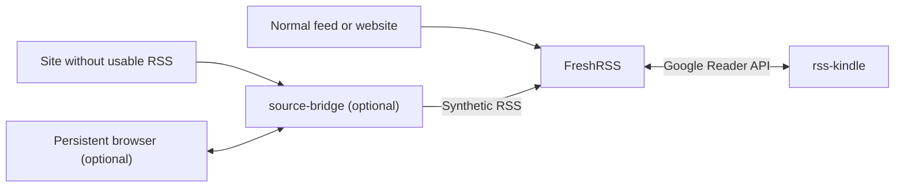

# RSS Kindle

`rss-kindle` is a self-hosted, Kindle-friendly reading interface for FreshRSS.

It is built for the common setup where FreshRSS already handles subscriptions, polling, unread state, and stars, and you want a much lighter reading UI for an e-ink browser.

## Screenshots

Actual Kindle views of the unread queue and an extracted article page:

<p align="center">
  
  
</p>

## Overview

Use this project when you want:

- a lightweight reading UI for a single FreshRSS account on Kindle or other low-power browsers
- deliberate read tracking: opening an item keeps it unread, and moving past its final page marks it read
- long-lived Kindle pairing, with the password kept as a fallback
- a local cache of extracted article bodies for faster re-reads
- a small dashboard for status, manual bridge refresh, devices, and backups
- optional bridge-assisted extraction for sites with weak or missing RSS feeds

If you already run FreshRSS and only want a better reading surface, you can ignore `source-bridge` and `browser-cdp`.

## Components

- `rss-kindle`: the reader UI and the main product in this repository
- FreshRSS: required; it remains the source of truth for subscriptions, unread state, and stars
- `source-bridge`: optional; generates synthetic RSS feeds and extraction fallbacks for difficult sites
- `browser-cdp`: optional; provides a long-lived Chromium session for automation-sensitive sites
- [`examples/reader-with-freshrss`](examples/reader-with-freshrss): bundled `rss-kindle` + FreshRSS example
- [`examples/full-stack`](examples/full-stack): bundled `rss-kindle` + FreshRSS + `source-bridge` + Caddy example

## Requirements

You need:

- Python 3.11+ and [`uv`](https://docs.astral.sh/uv/) for local development, or Docker for container-based setup
- a FreshRSS instance with API access enabled for the account `rss-kindle` will use
- a FreshRSS username and API password for that account

For FreshRSS itself, the default and recommended starting point is FreshRSS's own form login. `rss-kindle` is a separate frontend that reads from FreshRSS over the Google Reader API.

## Recommended Deployment Order

Most users should do this in order:

1. Get FreshRSS working first.
2. Run `rss-kindle` by itself against that FreshRSS instance.
3. If you also want to self-host FreshRSS, use the bundled reader + FreshRSS example.
4. Add `source-bridge` only if a site has no usable RSS feed or needs authenticated/browser-backed extraction.
5. Add `browser-cdp` only if a bridged site behaves badly under ordinary short-lived Playwright sessions.

## Quick Start

Choose one path:

1. You already have FreshRSS and just want the reader UI.
2. You want to self-host `rss-kindle` and FreshRSS together.
3. You want the full stack, including `source-bridge`.

### Path A: You Already Have FreshRSS

For the FreshRSS account `rss-kindle` should use:

1. Enable `Allow API access`.
2. Set an `API password`.
3. Note the username.
4. Note the API URL.

`FRESHRSS_API_URL` can be either:

- the full Google Reader endpoint, for example `https://freshrss.example.com/api/greader.php`
- or a FreshRSS base URL, for example `https://freshrss.example.com`

FreshRSS docs:

- [Mobile access](https://freshrss.github.io/FreshRSS/en/users/06_Mobile_access.html)
- [Google Reader API](https://freshrss.github.io/FreshRSS/en/developers/06_GoogleReader_API.html)

Before moving on, verify that your existing FreshRSS UI loads in a browser, for example:

- `https://freshrss.example.com/`

Then run the reader:

```bash
cp .env.example .env
```

Edit `.env` and set:

- `FRESHRSS_API_URL`
- `FRESHRSS_USERNAME`
- `FRESHRSS_API_PASSWORD`

Optional for a protected reader:

- `APP_AUTH_USERNAME`
- `APP_AUTH_PASSWORD`
- `APP_AUTH_SECRET`
- `APP_SECURE_COOKIES=false` for local plain-HTTP testing only

```bash
docker compose up --build -d rss-kindle
```

Verify:

- Kindle UI: [http://127.0.0.1:8000/](http://127.0.0.1:8000/)
- FreshRSS UI: your existing FreshRSS URL

If this is enough for your workflow, stop here.

### Path B: You Want To Self-Host FreshRSS Too

Use the bundled example in [examples/reader-with-freshrss](examples/reader-with-freshrss).

That stack includes:

- `rss-kindle`
- FreshRSS

Start FreshRSS first:

```bash
docker compose -f examples/reader-with-freshrss/docker-compose.yml up -d freshrss
```

Verify FreshRSS:

- FreshRSS setup or login UI: [http://127.0.0.1:8081/](http://127.0.0.1:8081/)

Then:

1. Complete the normal FreshRSS setup flow.
2. Create the FreshRSS account that `rss-kindle` should use.
3. Enable API access and set an API password for that account.

FreshRSS itself will continue to use FreshRSS's own login page. That is separate from the optional built-in `rss-kindle` login described later in this README.

Start the reader:

```bash
FRESHRSS_USERNAME=your-freshrss-username \
FRESHRSS_API_PASSWORD=replace-me \
docker compose -f examples/reader-with-freshrss/docker-compose.yml up -d rss-kindle
```

Optional for a protected reader in this path:

- `APP_AUTH_USERNAME`
- `APP_AUTH_PASSWORD`
- `APP_AUTH_SECRET`
- `APP_SECURE_COOKIES=false` while testing on plain `http://127.0.0.1:8000`

Those variables can be exported in the shell before the `docker compose` command or placed in a Compose `.env` file.

Verify:

- FreshRSS UI: [http://127.0.0.1:8081/](http://127.0.0.1:8081/)
- Kindle UI: [http://127.0.0.1:8000/](http://127.0.0.1:8000/)

If this covers your use case, stop here. If you later need bridged sites, move on to Path C.

### Path C: You Want The Full Stack

Use [examples/full-stack](examples/full-stack) when you want:

- `rss-kindle`
- FreshRSS
- `source-bridge`
- Caddy

This is the bridge-inclusive deployment path for sites that need synthetic RSS or authenticated extraction.

Prepare the bridge config:

```bash
cp source-bridge.example.toml source-bridge.toml
export RSS_KINDLE_SOURCE_BRIDGE_CONFIG="$(pwd)/source-bridge.toml"
export SOURCE_BRIDGE_ACCESS_TOKEN="$(openssl rand -hex 32)"
```

For a new FreshRSS instance, complete Path B first. Both examples use the same FreshRSS data paths by default. Stop the Path B stack before you start this one.

Update the example hostnames in `examples/full-stack/Caddyfile`. Make sure those names resolve to the Docker host.

FreshRSS itself will continue to use FreshRSS's own login page. That is separate from the optional built-in `rss-kindle` login described later in this README.

Start the stack:

```bash
FRESHRSS_API_URL=http://freshrss/api/greader.php \
FRESHRSS_USERNAME=your-freshrss-username \
FRESHRSS_API_PASSWORD=replace-me \
docker compose -f examples/full-stack/docker-compose.yml up -d
```

Recommended in this path:

- `APP_AUTH_USERNAME`
- `APP_AUTH_PASSWORD`
- `APP_AUTH_SECRET`
- `APP_ALLOWED_HOSTS`
- `APP_SECURE_COOKIES=false` only if you are testing over plain HTTP instead of HTTPS

`SOURCE_BRIDGE_ACCESS_TOKEN` is required. The other variables in this list are optional. Export them before the `docker compose` command or put them in a Compose `.env` file. Restrict access to that file.

Verify:

- FreshRSS UI: the FreshRSS hostname configured in `examples/full-stack/Caddyfile`
- Kindle UI: the reader hostname configured in `examples/full-stack/Caddyfile`

FreshRSS and `source-bridge` stay internal to the Docker network. FreshRSS should subscribe to the bridge with:

```text
http://source-bridge:8100/synthetic/{source_id}.xml
```

Set the feed HTTP username to `source-bridge`. Set its HTTP password to the value of `SOURCE_BRIDGE_ACCESS_TOKEN`. Do not put the token in the feed URL.

## How It Fits Together

- FreshRSS polls feeds and stores subscription state.
- `rss-kindle` reads from FreshRSS over the Google Reader API and renders a Kindle-friendly UI.
- `source-bridge`, when enabled, publishes synthetic RSS feeds that FreshRSS can subscribe to.
- `rss-kindle` can also use `source-bridge` as an authenticated extraction helper for difficult sites.



## What `rss-kindle` Does

- shows unread items from one FreshRSS account
- uses FreshRSS feeds and groups directly for navigation
- keeps an item unread when you open it and marks it read when you move past its final page
- supports starring and unstarring
- uses small color accents on color Kindles while keeping clear grayscale contrast
- uses large side controls for predictable page turns on e-ink screens
- updates read and star actions in place when the browser supports the small optional script
- provides a separate starred-items view
- prefers extracted full article text when possible
- falls back to feed-provided content when extraction fails
- caches extracted article HTML locally in SQLite
- reuses FreshRSS and extraction connections and preloads the first articles on each list page
- reports server work in the `Server-Timing` response header

## Kindle Reader Controls

The list view shows three article cards at a time and loads 15 articles per server batch by default. Select the left or right side control to move to newer or older cards. The page and article range in the header show your position. A `+` after a total means that FreshRSS has more articles that the reader has not loaded yet. When you reach the end of a batch, the right control loads the next one. The left control returns to batches that you already passed; it does not discard them.

Use **Categories** to open a picker with large touch targets. Use **Show read** and **Hide read** to control whether read articles appear. Select the checkmark on a card to mark that article as read. In the read view, select the return arrow to mark it unread.

In an article, the side controls move by one screen. A thin bar at the top shows reading progress, and the home icon returns to the article list. At the final screen, an end notice names the next article. Select the right control again to mark the current article as read and open the next one. Opening an article by itself does not mark it as read.

## Optional: Add `source-bridge`

Add `source-bridge` only when you need it.

Typical reasons:

- a site has no RSS feed
- a site's feed is incomplete or poor quality
- a site requires login or a browser-backed session before articles are readable

To start it:

```bash
cp source-bridge.example.toml source-bridge.toml
export SOURCE_BRIDGE_ACCESS_TOKEN="$(openssl rand -hex 32)"
docker compose up --build -d rss-kindle source-bridge
```

Connect FreshRSS to the same Docker network. It can then subscribe to synthetic feeds at:

```text
http://source-bridge:8100/synthetic/{source_id}.xml
```

Set the feed HTTP username to `source-bridge`. Set its HTTP password to the value of `SOURCE_BRIDGE_ACCESS_TOKEN`.

All detailed bridge documentation is in [docs/source-bridge.md](docs/source-bridge.md).

## Optional: Add `browser-cdp`

The `browser-cdp` sidecar is only for sites that behave differently when Playwright launches a short-lived browser itself.

Start it with:

```bash
docker compose --profile browser-cdp up --build -d browser-cdp
```

Then point the relevant bridge auth profile at:

```toml
browser_cdp_url = "http://browser-cdp:9223"
```

## Bundled Reference Stack

There are two bundled examples:

- [`examples/reader-with-freshrss`](examples/reader-with-freshrss): `rss-kindle` + FreshRSS
- [`examples/full-stack`](examples/full-stack): `rss-kindle` + FreshRSS + `source-bridge` + Caddy

Use the smaller one unless you already know you need bridged sites.

## Configuration

### Core `rss-kindle` Environment Variables

| Variable | Required | Purpose | Default |
| --- | --- | --- | --- |
| `FRESHRSS_API_URL` | yes | FreshRSS base URL or Google Reader API URL | none |
| `FRESHRSS_USERNAME` | yes | FreshRSS username | none |
| `FRESHRSS_API_PASSWORD` | yes | FreshRSS API password | none |
| `DATABASE_PATH` | no | SQLite cache for extracted articles | `data/rss_kindle.db` |
| `MAX_STREAM_ITEMS` | no | entries loaded in each server batch | `15` |
| `METADATA_CACHE_SECONDS` | no | feed and group metadata cache TTL | `60` |
| `ENTRY_CACHE_SECONDS` | no | entry cache TTL used to avoid a second FreshRSS request when an item opens | `300` |
| `STREAM_CACHE_SECONDS` | no | list page cache TTL; read and star actions keep cached pages correct | `60` |
| `ARTICLE_PREWARM_COUNT` | no | first list items extracted in the background; set `0` to disable | `2` |
| `HTTP_TIMEOUT_SECONDS` | no | outbound HTTP timeout | `20` |
| `USER_AGENT` | no | outbound user agent for extraction requests | `rss-kindle/0.2 (+https://example.invalid; self-hosted personal reader)` |
| `APP_AUTH_USERNAME` | no | enable built-in single-user login with this username | unset |
| `APP_AUTH_PASSWORD` | no | password for the built-in single-user login | unset |
| `APP_AUTH_SECRET` | no | HMAC signing secret for the login session cookie; required when app auth is enabled | unset |
| `APP_SESSION_MAX_AGE_SECONDS` | no | password session lifetime | `2592000` (30 days) |
| `APP_SECURE_COOKIES` | no | mark the session cookie `Secure`; leave `true` for HTTPS deployments | `true` |
| `APP_ALLOWED_HOSTS` | no | comma-separated hostnames allowed by the app and bridge | unset |
| `DEVICE_SESSION_MAX_AGE_SECONDS` | no | paired-device access lifetime | `31536000` (one year) |
| `PAIRING_CODE_TTL_SECONDS` | no | one-time pairing code lifetime | `600` |
| `PAIRING_CODE_ATTEMPTS` | no | failed guesses allowed before a pairing code is removed | `5` |
| `BACKUP_DIRECTORY` | no | directory for application backup archives | `data/backups` |
| `BACKUP_RETENTION_COUNT` | no | number of application archives to retain | `7` |
| `SOURCE_BRIDGE_API_URL` | no | optional base URL of a running `source-bridge` service | unset in the app; bridge Compose stacks use `http://source-bridge:8100` |
| `SOURCE_BRIDGE_ACCESS_TOKEN` | when the bridge runs | shared token used by `rss-kindle`, FreshRSS, and `source-bridge` | none; bridge access is denied when unset |

See [.env.example](.env.example) for the template.

Bridge-specific configuration and environment variables are documented in [docs/source-bridge.md](docs/source-bridge.md).

## Built-in Login

`rss-kindle` supports an optional built-in login for one user. The password session has full dashboard access. A paired Kindle has reader access only.

To enable it, set all three of these in `.env`:

- `APP_AUTH_USERNAME`
- `APP_AUTH_PASSWORD`
- `APP_AUTH_SECRET`

Example:

```dotenv
APP_AUTH_USERNAME=reader
APP_AUTH_PASSWORD=replace-me
APP_AUTH_SECRET=replace-with-a-long-random-string
```

What this does:

- protects the reader UI with a login page at `/login`
- redirects unauthenticated browser requests to that login page
- keeps password login as a fallback and as the only way to open `/dashboard`
- lets you create a six-digit, one-time code from `/dashboard`
- lets a Kindle enter that code at `/activate` and stay paired for one year by default
- lets you revoke each paired device from the dashboard

To pair a Kindle:

1. Sign in with the password on a laptop or phone.
2. Open `/dashboard` and select **New pairing code**.
3. Open `/activate` on the Kindle.
4. Enter the code and an optional device name.

The code expires after 10 minutes, works once, and permits five failed guesses by default. Creating a new code replaces the old code. A paired device cannot open the dashboard. Use the password when you need dashboard access.

What this does not do:

- it does not create FreshRSS users
- it does not provide multi-user accounts inside `rss-kindle`
- it does not provide a signup or "create account" page

In other words, you create the FreshRSS account in FreshRSS first, then optionally protect the `rss-kindle` frontend with one fixed username/password pair.

The shipped Compose files pass `APP_AUTH_*`, `APP_SECURE_COOKIES`, `APP_ALLOWED_HOSTS`, and `SOURCE_BRIDGE_ACCESS_TOKEN` through to the containers. Set those values in `.env` for the standard Docker-based setups.

For local HTTP testing only, set `APP_SECURE_COOKIES=false` or your browser will not send the login cookie back over plain `http://`. Leave it at the default `true` for HTTPS deployments.

## Dashboard

Open `/dashboard` with a password session. The dashboard shows:

- app version and uptime
- FreshRSS connection time and feed counts
- article cache size and extraction results
- paired devices, expiry dates, and revoke controls
- source bridge state and a manual refresh control
- retained application backups and download links

The public `/health` endpoint only reports app health and version. Container health checks use this endpoint. Reader responses also include `Server-Timing` and `X-RSS-Kindle-Version` headers.

## Backups

The dashboard can create a consistent ZIP backup with SQLite's online backup API. Each archive contains:

- the RSS Kindle database
- the source bridge database, if it is beside the reader database
- a manifest that records the archive format and app version

It does not contain FreshRSS data, private config, `.env` values, cookies, or browser profiles. Back up those items separately. Use your host or storage provider's scheduled backup system as the main recovery method. Use the application archive as a small, portable copy of reader state. The archive can contain cached article text, so store it as private data.

You can create an archive from the dashboard or from a shell:

```bash
docker compose exec rss-kindle python -m app.backup_cli
```

To restore an application archive:

1. Stop `rss-kindle` and `source-bridge`.
2. Keep a copy of the current data directory.
3. Extract the archive.
4. Copy the database files from its `data/` directory into the configured data directory.
5. Restore private config from your platform backup.
6. Start the services and check `/health` and `/dashboard`.

The app retains seven archives by default. This retention applies only to archives in `BACKUP_DIRECTORY`.

## Performance Checks

Laptop measurements are useful for server time, response size, regressions, and comparisons between versions. They do not measure e-ink refresh time, Kindle Wi-Fi behavior, or the Kindle browser's rendering cost. Use both types of test:

1. Run the repeatable benchmark from a laptop on the same network.
2. Check major UI changes on the physical Kindle.

Treat desktop browser emulation and throttling as approximations. They do not reproduce e-ink refresh behavior or every device-browser difference. Amazon also documents [Chrome DevTools remote debugging for supported Silk devices](https://docs.aws.amazon.com/silk/latest/developerguide/remote-debugging.html). That inspects a real device rather than simulating one. Use the physical Kindle for milestone checks.

Run the benchmark against an unprotected reader:

```bash
uv run rss-kindle-benchmark https://reader.example.com --path / --requests 20
```

For a protected reader, set the password credentials in the process environment. The benchmark signs in and keeps the returned cookie in memory:

```bash
RSS_KINDLE_BENCHMARK_USERNAME=reader \
RSS_KINDLE_BENCHMARK_PASSWORD=replace-me \
uv run rss-kindle-benchmark https://reader.example.com --path /starred
```

The output reports minimum, median, p95, and maximum client time, median body size, and the latest server timing breakdown. Compare the same path, network, item count, and cache state before and after each change.

Install the browser extra and run the throttled render benchmark to include browser parsing, painting, and asset loading:

```bash
uv sync --extra browser
uv run rss-kindle-browser-benchmark https://reader.example.com --path /
```

Its default profile uses a 600 by 800 viewport, a six-times CPU slowdown, 150 ms of added latency, and a 1 Mbit/s download rate. These values form a repeatable stress test, not an exact Colorsoft specification. Use `--cold` to clear the browser cache before each measured load. The same `RSS_KINDLE_BENCHMARK_USERNAME` and `RSS_KINDLE_BENCHMARK_PASSWORD` variables work with this command.

## Credentials And Secrets

Before you deploy, make sure you know which credential belongs to which service:

| Surface | Where the account is created | What you configure here |
| --- | --- | --- |
| FreshRSS web UI | in FreshRSS | your normal FreshRSS username and password |
| FreshRSS API access | in FreshRSS, on that same user account | `FRESHRSS_USERNAME` and `FRESHRSS_API_PASSWORD` |
| `rss-kindle` built-in login | no separate account store; fixed in config | `APP_AUTH_USERNAME`, `APP_AUTH_PASSWORD`, `APP_AUTH_SECRET` |
| `source-bridge` protection | no user accounts; shared token only | `SOURCE_BRIDGE_ACCESS_TOKEN` |

Quick checklist:

- create the FreshRSS user account in FreshRSS
- enable API access for that FreshRSS user and set its API password
- set `FRESHRSS_USERNAME` and `FRESHRSS_API_PASSWORD` for `rss-kindle`
- optionally set `APP_AUTH_*` if you want a login page in front of `rss-kindle`
- set `SOURCE_BRIDGE_ACCESS_TOKEN` whenever you run `source-bridge`

## Authentication Surfaces

There are three distinct authentication layers in a typical deployment:

- FreshRSS auth: protects the FreshRSS web UI and account management. For personal deployments, start with FreshRSS form authentication.
- `rss-kindle` auth: optional single-user login controlled by `APP_AUTH_*`.
- `source-bridge` auth: required shared-token protection controlled by `SOURCE_BRIDGE_ACCESS_TOKEN`.

These layers are independent:

- enabling `rss-kindle` login does not create or protect FreshRSS users
- protecting `source-bridge` does not protect the `rss-kindle` UI
- FreshRSS API access still depends on a valid FreshRSS account plus API password

## Security

Use this as the baseline checklist for a non-trivial deployment:

- for a public single-user deployment, set `APP_AUTH_USERNAME`, `APP_AUTH_PASSWORD`, and a long random `APP_AUTH_SECRET`
- leave `APP_SECURE_COOKIES=true` whenever the app is behind HTTPS
- set `APP_ALLOWED_HOSTS` to your real domain names when you know them
- keep FreshRSS on FreshRSS's own form login or a stronger SSO/reverse-proxy setup; do not disable FreshRSS auth on an exposed host
- keep `.env`, cookies, browser profiles, and `source-bridge.toml` out of git
- keep `source-bridge` internal and set `SOURCE_BRIDGE_ACCESS_TOKEN`; the bridge denies protected requests when the token is absent
- the app containers run without root, with all Linux capabilities removed and a read-only root filesystem in the shipped Compose files
- set `RSS_KINDLE_UID` and `RSS_KINDLE_GID` to the numeric owner of the host data directory; both default to `1000`
- the root [`docker-compose.yml`](docker-compose.yml) publishes only the reader on port `8000`; it keeps the bridge internal
- [`examples/reader-with-freshrss/docker-compose.yml`](examples/reader-with-freshrss/docker-compose.yml) binds FreshRSS to host loopback on port `8081`
- [`examples/full-stack/docker-compose.yml`](examples/full-stack/docker-compose.yml) publishes only Caddy; it keeps FreshRSS and the bridge internal

## Local Development

Use `uv`:

```bash
cp .env.example .env
uv sync --extra dev
```

Run the reader:

```bash
uv run uvicorn app.main:create_app --factory --reload
```

Run the bridge separately only if you are working on bridge functionality:

```bash
cp source-bridge.example.toml source-bridge.toml
SOURCE_BRIDGE_ACCESS_TOKEN=dev-only-token \
  uv run uvicorn app.source_main:create_app --factory --reload --port 8100
```

If your environment has trouble creating an in-project virtualenv on a mounted or networked filesystem, set:

```bash
UV_PROJECT_ENVIRONMENT=/tmp/rss-kindle-dev
```

## Docker Without Compose

The Dockerfile has a small default reader image and a separate browser image for `source-bridge` and `browser-cdp`. The small reader image does not contain Playwright or Chromium.

```bash
cp .env.example .env
docker build -t rss-kindle .
docker run --name rss-kindle \
  --env-file .env \
  -p 8000:8000 \
  -v "$(pwd)/data:/app/data" \
  --read-only \
  --tmpfs /tmp \
  --cap-drop ALL \
  --security-opt no-new-privileges:true \
  --user 1000:1000 \
  --restart unless-stopped \
  rss-kindle
```

Make sure the numeric user can write to the mounted data directory. Build `source-bridge` with `docker build --target browser -t rss-kindle-browser .`. See [docs/source-bridge.md](docs/source-bridge.md) for its command and config.

## Testing

```bash
uv sync --extra dev
uv run pytest -q
```
